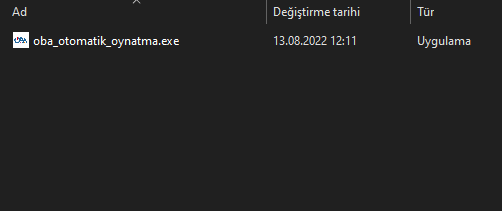
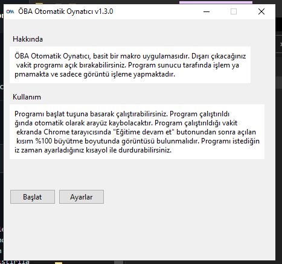
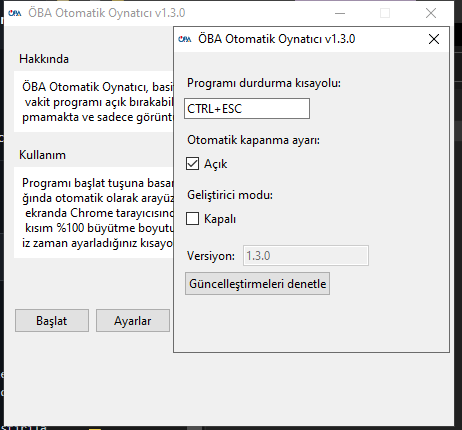

<h2> ÖBA Otomatik Oynatıcı </h2>
<b> Sürüm 1.3.6 </b>
  
<i>Uğraşmak yerine, dosyayı direkt <a href="https://github.com/MehmetKLl/OBA-Otomatik-Oynatici/raw/main/oba_otomatik_oynatma.zip" >buradan</a> indirebilirsiniz.</i>

<h4>Nedir bu ÖBA Otomatik Oynatıcı?</h4>

- ÖBA Otomatik Oynatıcı Python ile yazılan arayüzlü basit bir makro uygulamasıdır.
- Program ekran görüntüsünü işleyip doğal tıklama işlemlerini taklit ederek çalışmaktadır. 
- Programda requests, pywin32, pyautogui, tkinter ve keyboard modülleri/kütüphaneleri kullanılmıştır.

---------------------------------

<h4>Niye ÖBA Otomatik Oynatıcı?</h4>

- Program tamamen tıklama işlemlerini taklit ettiği için diğer alternatiflerine göre sıkıntı oluşturmaz. 
- Program açık kaynak kodlu olduğundan alternatiflerine göre çok daha risksiz ve güvenlidir. 
- Program, alternatifleri gibi kullanıcıyı uğraştırmayıp kullanıcı sadece "Başlat" tuşuna tıklayıp programı çalıştırabildiğinden kullanıcıya kolay bir deneyim sağlar. 

---------------------------------

<h4>Kullanmadan Önce Uyarılar</h4>

- Program ilk çalıştırıldığı vakit gereken dosyaları bilgisayara kurmakta ve programı öyle çalıştırmaktadır. Bundan dolayı program ilk seferde biraz geç açılabilir.
- Program ilk çalıştırıldığı vakit kurulması gereken dosyaları internetten indirdiğinden program ilk çalıştırıldığı vakit internet gerektirmektedir.
- Arayüz ekrana gelmeden önce sürüm denetleyicisi çalıştırıldığından arayüzün ekrana gelmesi bazı etkenlere bağlı olarak değişebilir.
- Program kurulduktan sonra aynı dosyayla kuruluma gerek olmadan tekrar çalıştırılabilir.
- -Program videoların izlendiği kısımdan itibaren açılmalıdır (Site boyutu %100 olmak şartıyla).- Aksi takdirde program çalışmayacaktır. 

---------------------------------

<h4>Kullanım</h4>

</img>
<i>İlk oba_otomatik_oynatma.exe çalıştırılır.</i>

  

</img>

  

</img>
<i>Ayarlar kısmından gerekli düzenlemeler yapılabilir.</i>

  

</img>
<i>"Başlat" tuşuna basarak program çalıştırılır.</i>

---------------------------------

<h4>Uyarılar</h4>

- Bu proje <a href="/LICENSE">MIT Lisansı</a> kapsamındadır.
- Program Chrome tarayıcısında %100 site büyütme boyutunda farklı ekran boyutlarında çalışabilmektedir. 
- Tüm çalıştırılabilir dosyalar 32 bit pyinstaller ile bundle edilmiştir, 64 bit sistemlerde de çalışmaktadır. 
- Program Windows 10 x64/x86, Windows 8 x64 ve Windows 7 x64/x86 sistemlerde kusursuz çalışmaktadır, program diğer sistemlerde denenmemiştir.
- Program "Eğitime başla/Eğitime devam et" tuşuna basılıp yeni ekran açıldığı zaman en önde tarayıcı gözükecek şekilde çalıştırılmalıdır.
- Program çalışırken fare ile oynanmamalıdır, eğer oynarsanız büyük ihtimalle programın videoyu kontrol etme mekanizması bozulacaktır.

---------------------------------

<h4>Desteklenen İşletim Sistemleri</h4>

|Windows|Desteklenme Durumu|
|-|-|
|Windows 11 x86|:ballot_box_with_check:|
|Windows 11 x64|:ballot_box_with_check:|
|Windows 10 x86|:ballot_box_with_check:|
|Windows 10 x64|:white_check_mark:|
|Windows 8 x86|:ballot_box_with_check:|
|Windows 8 x64|:white_check_mark:|
|Windows 7 x64|:white_check_mark:|
|Windows 7 x86|:white_check_mark:|

|MacOS|Desteklenme Durumu|
|-|-|
|*|:x:|

|Linux|Desteklenme Durumu|
|-|-|
|*|:x:|

<i>
:white_check_mark: : Belirtilen işletim sisteminde çalışıyor ve destekleniyor. 
:ballot_box_with_check: : Belirtilen işletim sisteminde çalıştırılıp denenmedi ancak destekleniyor. 
:x: : Desteklenmiyor. 
</i>

---------------------------------

<h4>Sürüm Notları</h4>

|Sürüm|Notlar|
|-|-|
|1.3.6|Programın mekanizması bilgisayarın uyku moduna girmesini engelleyecek biçimde geliştirildi. Optimizasyon sorunları, kod hataları giderildi.|
|1.3.5|Windows 7 desteği eklendi. Yeni log sistemi eklendi. Otomatik oynatma mekanizmasının kaynak kodları düzenlendi. Kurulum programının kodları düzenlendi. Arayüzün performansı arttırıldı.|
|1.3.4|Programın mekanizması geliştirildi. Log sistemi kaldırıldı. Kod yapısı düzenlendi.|
|1.3.3|Arayüz tasarımı geliştirildi.|
|1.3.2|Sürüm denetleyicisinin internet olmayınca oluşturduğu hatalar giderildi. Arayüz tasarımındaki hatalar giderildi. |
|1.3.1|Sürüm denetleyicisi geliştirildi. Kodlar düzenlendi. |
|1.3.0|Sürüm denetleyicisi eklendi. Bazı hatalar giderildi.|
|1.2.2|Hata yakalama geliştirildi. Bazı hatalar giderildi. Programın stabilitesi arttırıldı.|
|1.2.1|Arayüz eklendi. Programı durdurma kısayolunu değiştirme seçeneği eklendi.|
|1.1.0|Programın mekanizması geliştirildi.|
|1.0.0|Programın stabil olmayan ve yayınlanmayan ilk sürümü.|
