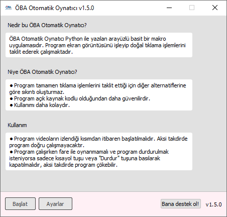
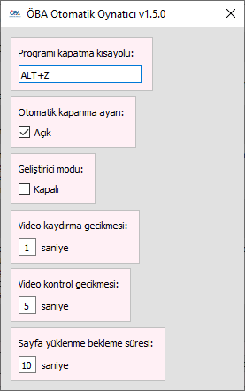

<h2> ÖBA Otomatik Oynatıcı </h2>
<b> Sürüm 1.4.8 </b>
 

 
<i>Uğraşmak yerine, dosyayı direkt <a href="https://github.com/MehmetKLl/OBA-Otomatik-Oynatici/raw/main/oba_otomatik_oynatma.zip" >buradan</a> indirebilirsiniz.</i>

--------------------------------- 

<h4>Nedir bu ÖBA Otomatik Oynatıcı?</h4>

- ÖBA Otomatik Oynatıcı Python ile yazılan arayüzlü basit bir makro uygulamasıdır.
- Program ekran görüntüsünü işleyip doğal tıklama işlemlerini taklit ederek çalışmaktadır. 
- Programda requests, pywin32, PyQt5, OpenCV ve keyboard modülleri/kütüphaneleri kullanılmıştır.

---------------------------------

<h4>Niye ÖBA Otomatik Oynatıcı?</h4>

- Program <b>sadece tıklama işlemlerini taklit ettiği</b> için diğer alternatiflerine göre sıkıntı oluşturmaz. 
- Program <b>açık kaynak kodlu</b> olduğundan alternatiflerine göre çok daha risksiz ve güvenlidir. 
- Program, alternatifleri gibi <b>kullanıcıyı uğraştırmayıp</b> kullanıcı sadece "Başlat" tuşuna tıklayıp programı çalıştırabildiğinden kullanıcıya kolay bir deneyim sağlar. 

---------------------------------

<h4>Kullanmadan Önce Uyarılar</h4>

- Program ilk çalıştırıldığı vakit gereken dosyaları bilgisayara kurmakta ve programı öyle çalıştırmaktadır. Bundan dolayı program ilk seferde biraz geç açılabilir.
- Program ilk çalıştırıldığı vakit kurulması gereken dosyaları internetten indirdiğinden program ilk çalıştırıldığı vakit internet gerektirmektedir.
- Arayüz ekrana gelmeden önce sürüm denetleyicisi çalıştırıldığından arayüzün ekrana gelmesi bazı etkenlere bağlı olarak değişebilir.
- Program kurulduktan sonra aynı dosyayla kuruluma gerek olmadan tekrar çalıştırılabilir.
- <b><ins>Program videoların izlendiği kısımdan itibaren başlatılmalıdır (Site boyutu %100 olmak şartıyla)</ins></b>. Aksi takdirde program doğru <b>çalışmayacaktır</b>.
- <b><ins>Program çalışırken fare ile oynanmamalı</ins></b> ve program durdurulmak isteniyorsa <b><ins>sadece kısayol tuşuyla kapatılmalıdır</ins></b>, aksi takdirde program çökebilir. 

---------------------------------

<h4>Kullanım</h4>

<picture>
<source media="(prefers-color-scheme: dark)" srcset="img/file_dark.png">

</img>
</picture>
 
<i>İlk oba_otomatik_oynatma.exe çalıştırılır.</i>

  

<picture>
<source media="(prefers-color-scheme: dark)" srcset="img/main_gui_dark.png">

</img>
</picture>

  

<picture>
<source media="(prefers-color-scheme: dark)" srcset="img/settings_dark.png">

</img>
</picture>
 
<i>Ayarlar kısmından gerekli düzenlemeler yapılabilir.</i>

  

<picture>
<source media="(prefers-color-scheme: dark)" srcset="img/main_gui_dark.png">

</img>
</picture>
 
<i>"Başlat" tuşuna basarak program çalıştırılır.</i>

---------------------------------

<h4>Desteklenen İşletim Sistemleri</h4>

|Windows|Desteklenme Durumu|
|-|-|
|Windows 11 x86|:ballot_box_with_check:|
|Windows 11 x64|:ballot_box_with_check:|
|Windows 10 x86|:ballot_box_with_check:|
|Windows 10 x64|:white_check_mark:|
|Windows 8 x86|:white_check_mark:|
|Windows 8 x64|:white_check_mark:|
|Windows 7 x64|:white_check_mark:|
|Windows 7 x86|:white_check_mark:|

|MacOS|Desteklenme Durumu|
|-|-|
|*|:x:|

|Linux|Desteklenme Durumu|
|-|-|
|*|:x:|

<i>
:white_check_mark: : Belirtilen işletim sisteminde çalışıyor ve destekleniyor. 
:ballot_box_with_check: : Belirtilen işletim sisteminde çalıştırılıp denenmedi ancak destekleniyor. 
:x: : Desteklenmiyor. 
</i>

---------------------------------

<h4>Sürüm Notları</h4>

|Sürüm|Notlar|
|-|-|
|1.4.8|Program ve arayüz hataları giderildi.|
|1.4.7|Program hataları giderildi.|
|1.4.6|Program hataları giderildi.|
|1.4.5|Ayarlamalarla ilgili önemli algoritma hataları giderildi. Uyumluluk sorunları düzeltildi.|
|1.4.4|Programın işletim sistemi tarafından DWM API kullanılarak karanlık tema kullanıyor olarak işaretlenmesi sağlandı.|
|1.4.3|Karanlık mod eklendi.|
|1.4.2|Önemli algoritma hataları giderildi. Uyumluluk sorunları giderildi.|
|1.4.1|Windows 10 için uyumluluk hataları giderildi.|
|1.4.0|Programın arayüzü yeniden tasarlandı ve sil baştan Qt kütüphanesi ile yazıldı. Programın otomatik oynatma altyapısı OpenCV kütüphanesi kullanılarak sıfırdan yazıldı. Programın otomatik oynatma mekanizması geliştirildi. Programın optimizasyonunu arttırmak için otomatik oynatma mekanizmasına kontrol geciktirme parametreleri eklendi.|
|1.3.6|Programın mekanizması bilgisayarın uyku moduna girmesini engelleyecek biçimde geliştirildi. Optimizasyon sorunları, kod hataları giderildi.|
|1.3.5|Windows 7 desteği eklendi. Yeni log sistemi eklendi. Otomatik oynatma mekanizmasının kaynak kodları düzenlendi. Kurulum programının kodları düzenlendi. Arayüzün performansı arttırıldı.|
|1.3.4|Programın mekanizması geliştirildi. Log sistemi kaldırıldı. Kod yapısı düzenlendi.|
|1.3.3|Arayüz tasarımı geliştirildi.|
|1.3.2|Sürüm denetleyicisinin internet olmayınca oluşturduğu hatalar giderildi. Arayüz tasarımındaki hatalar giderildi. |
|1.3.1|Sürüm denetleyicisi geliştirildi. Kodlar düzenlendi. |
|1.3.0|Sürüm denetleyicisi eklendi. Bazı hatalar giderildi.|
|1.2.2|Hata yakalama geliştirildi. Bazı hatalar giderildi. Programın stabilitesi arttırıldı.|
|1.2.1|Arayüz eklendi. Programı durdurma kısayolunu değiştirme seçeneği eklendi.|
|1.1.0|Programın mekanizması geliştirildi.|
|1.0.0|Programın stabil olmayan ve yayınlanmayan ilk sürümü.|

---------------------------------

<h4>Beni desteklemek için...</h4>

Bu projeyi <i>tek başıma</i> geliştiriyor ve projeyi <i>hiçbir menfaat beklemeksizin ücretsiz</i> ve <i>herkese açık</i> olarak yayınlıyorum. Eğer ki projeyi beğendiyseniz ve bana biraz da olsa destek olmak istiyorsanız <b>projeyi yıldızlamanız</b> <i>yeterli</i> olacaktır. 
